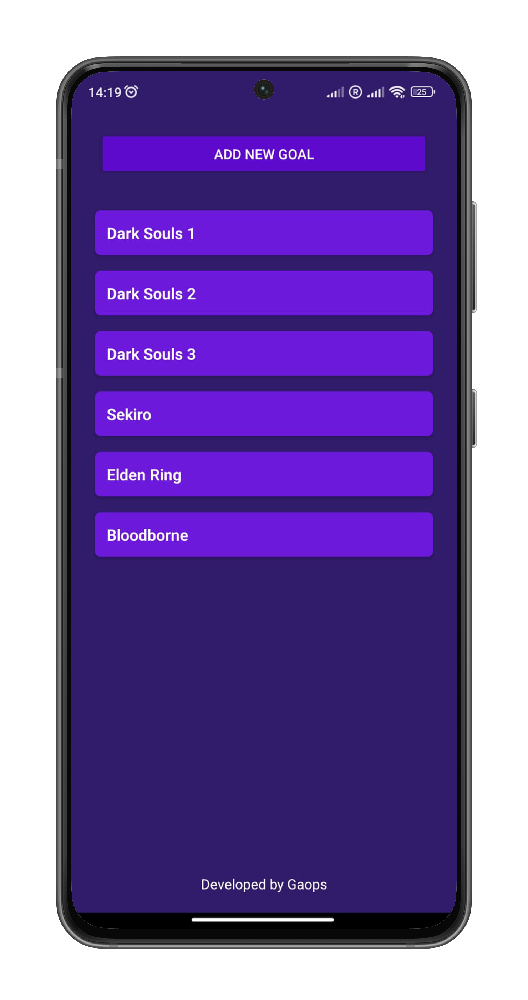
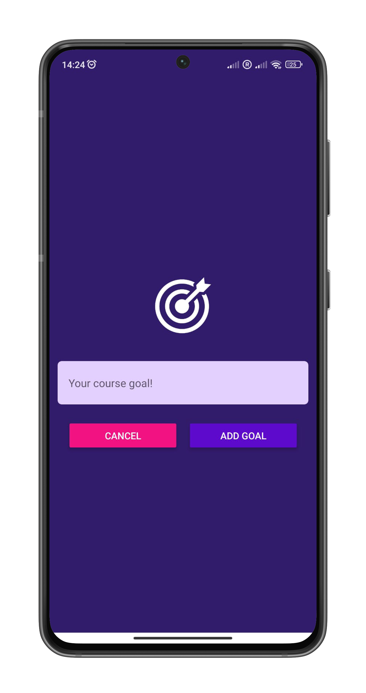

# Goals App

Goals App is a simple learning application built using React Native. It allows users to create, manage, and track their goals efficiently.

## Features

- Add, and delete goals
- Swipe to delete with gestures

## Installation

1. Clone the repository:
   ```bash
   git clone git@github.com:gaabriel165/goals-app.git
   ```

<p align="center">
  
  
</p>
